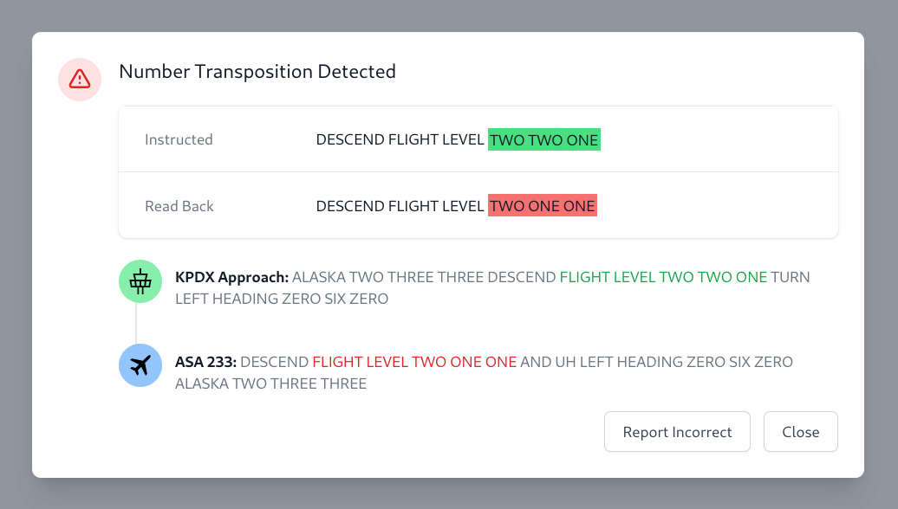
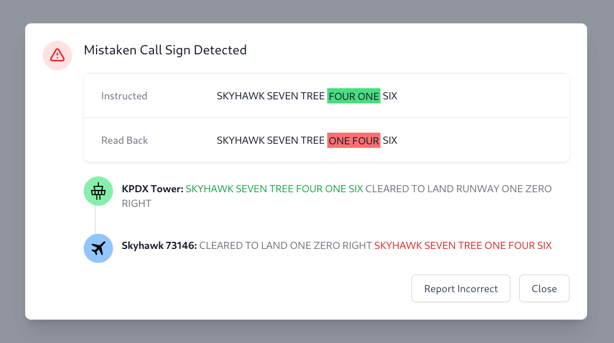
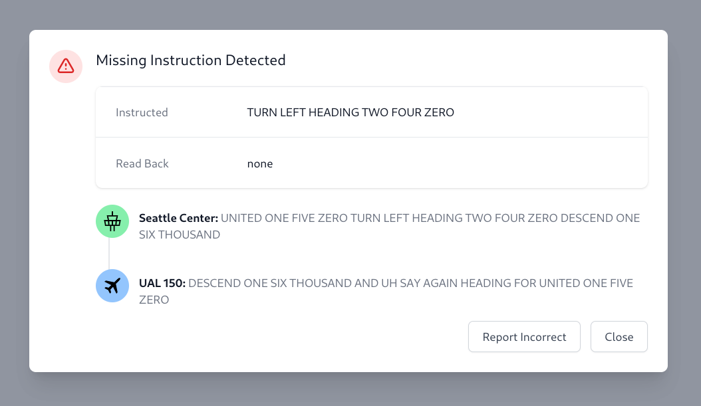

# ACRP Miscommunication Detection


This repository houses the code for the 2022 Airport Cooperative Research
Program (ACRP) Design Competition paper titled "Improving Pilot-Controller
Communication Through the Use of Artificial Intelligence for Real-Time Radio
Analysis".

## Tranmission Parsing

Transmissions are expected to be fully textual, with numbers spelled out as
pronounced. For example:

```
AIRPLANE ONE TWO THREE TURN RIGHT HEADING TWO NINER ZERO CLIMB AND MAINTAIN FIVE THOUSAND

UH TURN RIGHT HEADING TWO NINE ZERO AND SAY AGAIN ALTITUDE AIRPLANE ONE TWO THREE

AIRPLANE ONE TWO THREE CLIMB AND MAINTAIN FIVE THOUSAND

UP TO FIVE THOUSAND AIRPLANE ONE TWO THREE
```

The transmission parser takes each individual tranmission as input, and outputs
a structured representation of the transmission:

```ts
const transmission = 'SKYHAWK SEVEN THREE ONE FOUR SIX DESCEND FLIGHT LEVEL ONE NINER ZERO AND UH TURN LEFT HEADING ZERO SIX ZERO';
parseTransmission(transmission);

// {
//   instructions: [
//     {
//       type: InstructionType.Descend,
//       specifiers: [
//         {
//           type: SpecifierType.FlightLevel,
//           value: 'ONE NINER ZERO',
//         },
//       ],
//     },
//     {
//       type: InstructionType.Turn,
//       specifiers: [
//         {
//           type: SpecifierType.Direction,
//           value: 'LEFT',
//         },
//         {
//           type: SpecifierType.Heading,
//           value: 'ZERO SIX ZERO',
//         },
//       ],
//     },
//   ],
//   type: TransmissionType.Issuance,
// }
```

Similarly, for a readback:

```ts
const transmission = 'UH DESCENDING TO FLIGHT LEVEL ONE NINER ZERO AND TURNING LEFT HEADING ZERO SIX ZERO SKYHAWK SEVEN THREE ONE FOUR SIX';
parseTransmission(transmission);

// {
//   instructions: [
//     {
//       type: InstructionType.Descend,
//       specifiers: [
//         {
//           type: SpecifierType.FlightLevel,
//           value: 'ONE NINER ZERO',
//         },
//       ],
//     },
//     {
//       type: InstructionType.Turn,
//       specifiers: [
//         {
//           type: SpecifierType.Direction,
//           value: 'LEFT',
//         },
//         {
//           type: SpecifierType.Heading,
//           value: 'ZERO SIX ZERO',
//         },
//       ],
//     },
//   ],
//   type: TransmissionType.Readback,
// }
```

The parser is designed to be easily extensible, so that new instructions can be
detected in the future.

## Miscommunication Detection

Miscommunication detection is performed by individual Detector modules.
Structuring the code in this way allows for new detectors to be easily added in
the future. Currently, the following detectors are available:

1. Number Transposition Detector: detects number transpositions, such as "TWO THREE ONE" vs. "TWO ONE THREE"
1. Mistaken Call Sign Detector: detects mistaken callsigns, such as "UNITED ONE SEVEN TWO" vs. "UNITED TWO SEVEN ONE"
1. Incomplete Readback Detector: detects missing instructions in a readback

## Alerting




